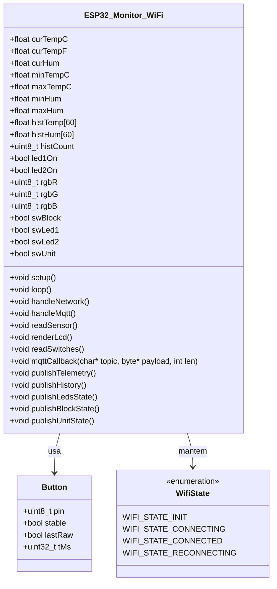
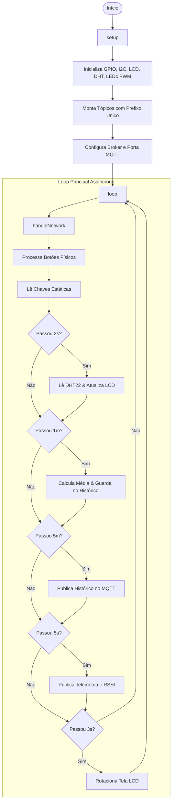
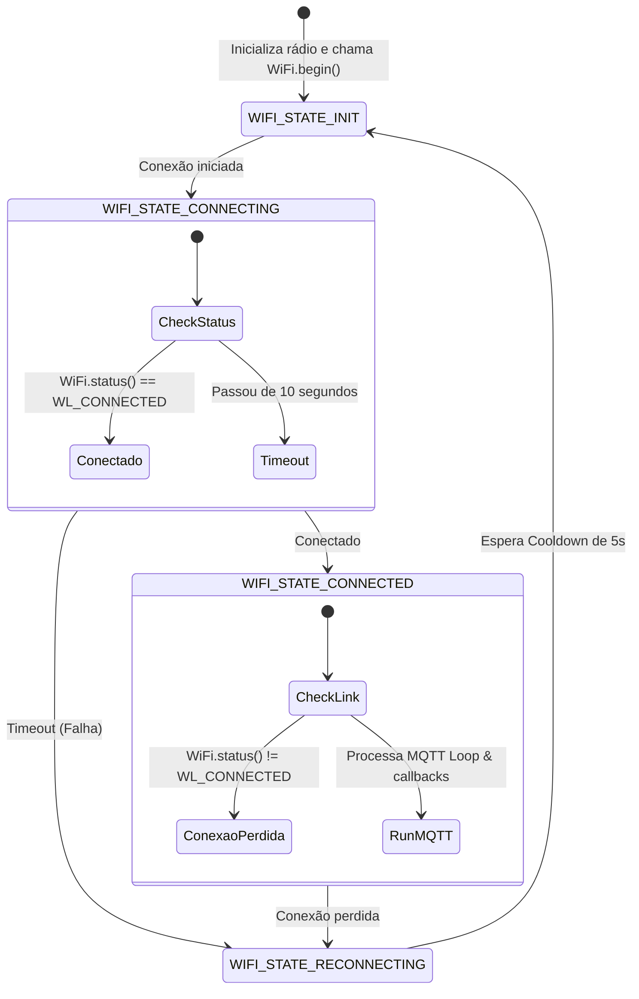

# Monitoramento de Temperatura e Umidade usando Wi-Fi e ESP32

Este repositório contém a atividade prática da disciplina **GEX1087 – Tópicos Especiais em Computação XXVII** (Curso de Ciência da Computação - UFFS - Campus Chapecó), ministrada pelo **Prof. Dr. Luciano L. Caimi**.

O objetivo do projeto é desenvolver um sistema embarcado que monitora temperatura e umidade usando um sensor DHT22, exibe as leituras localmente em um display LCD de 16x2 I2C, e envia telemetria e dados históricos via Wi-Fi e protocolo MQTT para um broker público. O controle remoto de atuadores (LEDs simples e LED RGB) é feito por meio de um **Dashboard Web** customizado construído com HTML5/CSS3/JavaScript sobre WebSockets.

---

## 🚀 Escolha da Plataforma: Opção B (MQTT Público + Dashboard Web)

Optamos pela **Opção B**, desenvolvendo um painel web próprio em HTML/CSS/JS que se comunica com o ESP32 através de WebSockets no broker público da HiveMQ. Essa escolha oferece controle visual total sobre a interface do usuário (design premium responsivo com dark mode e glassmorphism), além de eliminar dependências de limites restritivos de planos gratuitos de plataformas prontas.

### 📌 Links do Projeto
*   **Simulador Wokwi:** [Link do Projeto no Wokwi](https://wokwi.com/projects/468106849083704321)
*   **Repositório GitHub:** [https://github.com/ROCKzYyN/App-wifi.git](https://github.com/ROCKzYyN/App-wifi.git)

---

## 🛠️ Arquitetura de Hardware e Conexões

A arquitetura de hardware é idêntica à utilizada na prática anterior baseada em BLE, mapeada nos seguintes GPIOs do ESP32:

*   **DHT22 (Sensor de Temperatura/Umidade):** GPIO 18 (com resistor de pull-up)
*   **Display LCD 16x2 I2C:** SDA (GPIO 21) / SCL (GPIO 22)
*   **LED 1 (Verde):** GPIO 2
*   **LED 2 (Vermelho):** GPIO 15
*   **LED RGB (Anodo ou Catodo Comum):**
    *   Vermelho (R): GPIO 17
    *   Verde (G): GPIO 16
    *   Azul (B): GPIO 4
*   **Botões do tipo Push-Button:**
    *   Push-Button 1 (Alterna Tela LCD): GPIO 26
    *   Push-Button 2 (Reset Mín/Máx): GPIO 27
*   **Chaves do tipo Switch-Button:**
    *   Switch 1 (Bloqueio Local vs. Remoto): GPIO 34
    *   Switch 2 (Controle Local LED 1): GPIO 32
    *   Switch 3 (Controle Local LED 2): GPIO 35
    *   Switch 4 (Unidade do Gráfico - °C vs. °F): GPIO 33

---

## 📊 Estrutura de Dados e Tópicos MQTT

Tópicos utilizados para comunicação entre o ESP32 e o Dashboard Web.
Para evitar colisões no broker público, os tópicos utilizam o prefixo configurável definido em `secrets.h` (ex.: `uffs/gex1087/monitor_wifi_dupla`).

| Tópico | Tipo de Dado | Direção | Descrição |
| :--- | :--- | :--- | :--- |
| `<prefixo>/status` | String | ESP32 $\rightarrow$ Nuvem | LWT (Last Will): `"online"` na conexão, `"offline"` na queda abrupta. (Retained) |
| `<prefixo>/temperatura/celsius` | Float (String) | ESP32 $\rightarrow$ Nuvem | Temperatura atual em Celsius (°C) |
| `<prefixo>/temperatura/fahrenheit` | Float (String) | ESP32 $\rightarrow$ Nuvem | Temperatura atual em Fahrenheit (°F) |
| `<prefixo>/umidade` | Float (String) | ESP32 $\rightarrow$ Nuvem | Umidade relativa do ar atual (%) |
| `<prefixo>/rssi` | Int (String) | ESP32 $\rightarrow$ Nuvem | Intensidade do sinal Wi-Fi recebido (dBm) |
| `<prefixo>/historico` | JSON String | ESP32 $\rightarrow$ Nuvem | Objeto JSON com as últimas 60 médias de 1 min de Temp e Umid |
| `<prefixo>/historico/requisicao` | String | Nuvem $\rightarrow$ ESP32 | Solicita ao ESP32 a republicação imediata do histórico (`"get"`) |
| `<prefixo>/leds/estado` | JSON String | ESP32 $\rightarrow$ Nuvem | Estado atual dos LEDs simples: `{"led1":bool,"led2":bool}` |
| `<prefixo>/leds/comando` | JSON String | Nuvem $\rightarrow$ ESP32 | Dashboard envia novos estados: `{"led1":bool}` e/ou `{"led2":bool}` |
| `<prefixo>/rgb/comando` | String | Nuvem $\rightarrow$ ESP32 | Dashboard envia a cor do RGB no formato: `"R,G,B"` (ex: `"255,128,0"`) |
| `<prefixo>/controle/bloqueio` | String | ESP32 $\rightarrow$ Nuvem | Estado do Switch 1: `"local"` (ignora comandos remotos) ou `"remote"` |
| `<prefixo>/controle/unidade` | String | ESP32 $\rightarrow$ Nuvem | Estado do Switch 4: `"C"` (Celsius) ou `"F"` (Fahrenheit) no gráfico |
| `<prefixo>/controle/reset` | String | Nuvem $\rightarrow$ ESP32 | Comando enviado do dashboard para resetar min/max localmente |

---

## 📈 Diagrama de Classes e Fluxogramas do Firmware

### 1. Diagrama de Classes

### 2. Fluxograma Principal do Firmware

### 3. Máquina de Estados da Conexão (Sem bloqueios no firmware)

---

## ⚙️ Instruções de Configuração e Execução

### 1. Configurando o Firmware do ESP32 (`ESP32-Code`)

1.  Navegue até a pasta `MonitorWiFi/ESP32-Code/`.
2.  Duplique o arquivo `secrets.h.example` e renomeie-o para `secrets.h`.
3.  Abra o `secrets.h` e configure suas credenciais.
4.  No Arduino IDE, certifique-se de ter as seguintes bibliotecas instaladas:
    *   `PubSubClient` (por Nick O'Leary)
    *   `DHT sensor library` (por Adafruit)
    *   `LiquidCrystal I2C` (por Frank de Brabander)
5.  Compile e carregue o código no seu ESP32.

### 2. Executando o Dashboard Web (`dashboard`)

O Dashboard Web é uma aplicação estática (HTML/CSS/JS) e roda diretamente no navegador.

1.  Abra o arquivo `MonitorWiFi/dashboard/index.html` em qualquer navegador moderno.
2.  Insira o broker WebSocket e o prefixo e clique em **Conectar**.

### 3. Executando o Aplicativo Mobile (Expo / React Native)

O aplicativo mobile foi adaptado para se conectar via MQTT sobre WebSockets utilizando a biblioteca `paho-mqtt`.

1.  Certifique-se de ter o Node.js instalado e execute `npm install` dentro da pasta `MonitorWiFi/` (antiga `MonitorBLE`).
2.  Inicie o servidor de desenvolvimento do Expo com `npx expo start` (ou `npm start`).
3.  Abra o aplicativo Expo Go no celular para testar ou gere o APK executando o comando de build (`eas build -p android`).

---

## ⚠️ Relato de Limitações e Comportamento

Durante a modelagem e testes na arquitetura Wi-Fi + MQTT sobre o broker público `broker.hivemq.com`, foram observados os seguintes pontos:

1.  **Instabilidade e Latência do Broker Público:** Brokers MQTT públicos e gratuitos não garantem nível de serviço (SLA). Em períodos de pico, observou-se latências de envio/recebimento de até 1.5 segundos na alteração da cor RGB ou no acionamento dos LEDs, além de ocasionais quedas de conexão forçadas pelo broker (tratadas robustamente pela máquina de reconexão do ESP32).
2.  **Segurança em Brokers Públicos:** Por não requerer credenciais rígidas e ser compartilhado publicamente, qualquer cliente que assine os tópicos com o prefixo correto pode intervir no controle dos LEDs ou ler as medições. Por isso, a adoção de um prefixo não óbvio (como um hash ou identificador exclusivo de grupo) foi crucial para mitigar esse risco de interferência.
3.  **Tamanho do Buffer MQTT:** O PubSubClient por padrão possui um buffer pequeno (256 bytes) para mensagens. Para que o envio do JSON contendo o vetor de 60 médias de temperatura e umidade funcionasse sem cortes, foi necessário aumentar explicitamente o buffer da biblioteca para 1024 bytes (`mqttClient.setBufferSize(1024)`).
