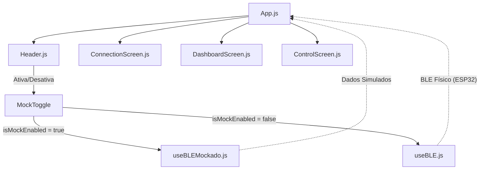

# Monitor BLE - ESP32 📱🔌

[](https://expo.dev/accounts/wictorrkz/projects/MonitorBLE/builds/c5c98959-ca3b-4fd2-90dc-b1892a2485fc)

📱 **[CLIQUE AQUI PARA INSTALAR O APP NO SEU ANDROID (APK)](https://expo.dev/accounts/wictorrkz/projects/MonitorBLE/builds/c5c98959-ca3b-4fd2-90dc-b1892a2485fc)**

---

Aplicativo desenvolvido para a disciplina de **Tópicos Especiais**, com o objetivo de realizar o monitoramento de telemetria em tempo real e o controle de atuadores em uma placa **ESP32** utilizando comunicação **Bluetooth Low Energy (BLE)** em um ambiente mobile desenvolvido com **React Native** e **Expo**.

---

## 🚀 Funcionalidades Principais

*   **Telemetria Real-Time**: Exibição da temperatura (°C e °F) e umidade (%) enviadas pelo rádio BLE do ESP32.
*   **Histórico de Leituras**: Gráficos de linha de temperatura e umidade com atualizações constantes de dados recentes.
*   **Histórico Acumulado (Hora em Hora)**: Gráfico unificado mostrando a relação de temperatura e umidade registradas de hora em hora nas últimas 6 horas.
*   **Controle de Atuadores (ESP32)**:
    *   Acionamento de relés/LEDs simples nos pinos do dispositivo com resposta imediata e técnica de *Optimistic Updates*.
    *   Painel de seleção de cores para LED RGB.
    *   Envio de comandos personalizados para o hardware (como redefinir valores mínimos e máximos da telemetria ou mudar telas em um display físico LCD).
*   **Métricas do Link de Conexão**:
    *   **Monitoramento de RSSI (Potência de Sinal)**: Medição de intensidade de sinal com indicadores visuais qualitativos (Excelente, Bom, Regular, Fraco) e gráficos de instabilidade de sinal.
    *   **Taxa PPM (Pacotes por Minuto)**: Um contador da frequência de pacotes recebidos de minuto em minuto do ESP32.
*   **Simulador Interno (Modo Mock)**: Chave no cabeçalho ("MOCK") que permite testar toda a interface do aplicativo, gráficos e respostas de botões de forma simulada, mesmo sem possuir a placa ESP32 por perto.

---

## 🛠️ Tecnologias Utilizadas

*   **React Native** & **Expo** (Framework de Desenvolvimento)
*   **React Hooks** (Gerenciamento de Estado e Ciclo de Vida)
*   **react-native-ble-plx** (Biblioteca nativa para gerenciamento de Bluetooth)
*   **react-native-chart-kit** (Renderização dos gráficos de linha do Dashboard e do Sinal RSSI)
*   **Vanilla CSS** adaptado ao StyleSheet nativo para uma interface limpa, moderna e responsiva.

---

## 📋 Arquitetura do App

O projeto separa as regras de negócio da interface utilizando React Hooks customizados que compartilham a mesma assinatura, permitindo que a aplicação alterne dinamicamente entre o hardware físico e o simulador:



---

## 💻 Como Rodar o Projeto

### Pré-requisitos

Antes de iniciar, certifique-se de ter instalado em sua máquina:
1.  [Node.js](https://nodejs.org/) (versão LTS recomendada).
2.  [Android Studio](https://developer.android.com/studio) com as SDKs e ferramentas de build configuradas (necessário para compilações nativas de BLE).
3.  Um dispositivo físico Android/iOS ou Emulador com suporte a Bluetooth configurado.

### Passo a Passo

1.  **Clonar o Repositório**:
    ```bash
    git clone <url-do-repositorio>
    cd App-bt
    ```

2.  **Instalar as Dependências**:
    No diretório raiz da pasta do aplicativo mobile (`MonitorBLE`), execute:
    ```bash
    cd MonitorBLE
    npm install
    ```

3.  **Compilar e Rodar o App (Android)**:
    Como o plugin de Bluetooth requer módulos nativos, utilize o comando para rodar em build de desenvolvimento:
    ```bash
    npx expo run:android
    ```
    *Isso compilará o APK de desenvolvimento no seu dispositivo físico conectado via USB ou no emulador.*

4.  **Iniciar o Servidor Metro** (se não iniciar sozinho):
    ```bash
    npx expo start
    ```

5.  **Utilizando o Modo Mock**:
    Caso queira testar a interface sem um ESP32 configurado:
    - Abra o aplicativo instalado.
    - No canto superior direito, ative a chave **MOCK**.
    - Clique em buscar dispositivos e conecte no dispositivo simulado para ver os gráficos e métricas oscilarem imediatamente.

---

## 📊 Estrutura do Perfil GATT (Serviços e Características)

Para organizar os dados que trafegam entre o ESP32 e o aplicativo móvel, o perfil de banco de dados do Bluetooth Low Energy (GATT) está estruturado em **3 Serviços separados** com suas respectivas características e propriedades:

| Serviço GATT | UUID do Serviço | Característica | UUID Característica | Propriedades | Descrição / Funcionamento |
| :--- | :--- | :--- | :--- | :--- | :--- |
| **1. Monitoramento Ambiental** | `0x181A` | **Dados Atuais** | `4fafc202-1fb5-459e-8fcc-c5c9c331914b` | Read, Notify | Envia 20 bytes contendo os floats de temperatura, umidade, min/max e estado. |
| | | **Gráfico Histórico** | `4fafc206-1fb5-459e-8fcc-c5c9c331914b` | Read | Transmite vetor de 48 bytes (médias das últimas 6 horas) ao se conectar. |
| **2. Controle de Atuadores** | `4fafc201-1fb5-459e-8fcc-c5c9c331914b` | **LEDs Simples** | `4fafc203-1fb5-459e-8fcc-c5c9c331914b` | Read, Write | Aciona LEDs físicos do ESP32 (vermelho/verde) ou lê os estados físicos das chaves. |
| | | **LED RGB** | `4fafc204-1fb5-459e-8fcc-c5c9c331914b` | Write No Resp | Controla a mistura de cores PWM do LED RGB (3 bytes: R, G, B) de forma fluida. |
| | | **Comandos** | `4fafc205-1fb5-459e-8fcc-c5c9c331914b` | Write No Resp | Redefinições e navegação (cmd 1 = reset min/max, cmd 2 = muda tela LCD, cmd 3 = RSSI). |
| **3. Indicadores de Conexão** | `4fafc210-1fb5-459e-8fcc-c5c9c331914b` | **RSSI** | `4fafc211-1fb5-459e-8fcc-c5c9c331914b` | Read, Notify | Indica a potência da intensidade do sinal medido do link de rádio. |
| | | **Contador Notif.** | `4fafc212-1fb5-459e-8fcc-c5c9c331914b` | Read | Contador oficial das notificações enviadas pelo ESP32 no último minuto (PPM). |
